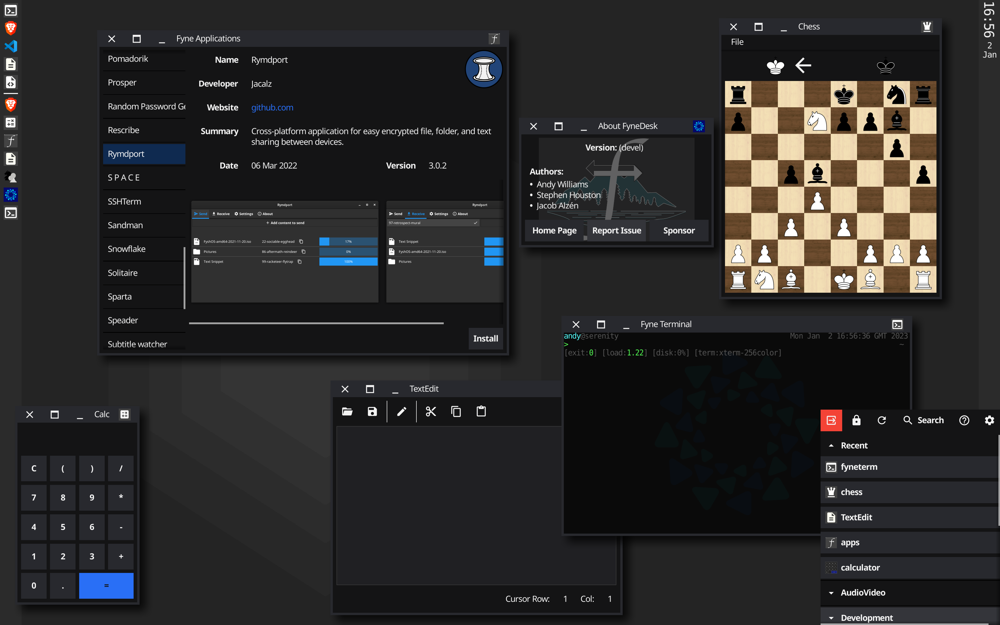

<p align="center">
  <a href="https://godoc.org/fyne.io/fynedesk" title="GoDoc Reference" rel="nofollow"></a>
  <a href="https://github.com/fyne-io/fynedesk/releases/tag/v0.2.0" title="0.2.0 Release" rel="nofollow"></a>
  <a href='http://gophers.slack.com/messages/fyne'></a>

  <br />
  <a href="https://goreportcard.com/report/fyne.io/fynedesk"></a>
  <a href="https://travis-ci.org/fyne-io/fynedesk"></a>
  <a href='https://coveralls.io/github/fyne-io/fynedesk?branch=develop'></a>
</p>

# About

FyneDesk is an easy to use Linux/Unix desktop environment following material design.
It is build using the [Fyne](https://fyne.io) toolkit and is designed to be
easy to use as well as easy to develop. We use the Go language and welcome
any contributions or feedback for the project.

# Dependencies

For a full desktop experience you will also need the following external tools installed:

- xbacklight
- arandr

# Getting Started

Using standard go tools you can install FyneDesk using:
```
go get fyne.io/fynedesk/cmd/fynedesk
```

Once installed you can run the following commands from the root of the installed fynedesk folder (usually $GOPATH/src/fyne.io/fynedesk/) to set up fynedesk as a selectable desktop option in your login manager (such as LightDM for example).
```
make
sudo make install
```

You can also run it in an embedded X window for testing using:

    make embed

It should look like this:

<p align="center" markdown="1">
  
</p>

If you run the command when there is a window manager running, or on
an operating system that does not support window managers (Windows or
macOS) then the app will start in UI test mode.
When loaded in this way you can run all of the features except the
controlling of windows - they will load on your main desktop.

# Runner

A desktop needs to be rock solid and, whilst we are working hard to get there,
any alpha or beta software can run in to unexpected issues. 
For that reason we have included a `fynedesk_runner` utility that can help
manage unexpected events. If you start the desktop using the runner then
if a crash occurs it will normally recover where it left off with no loss
of data in your applications.

Using standard go tools you can install the runner using:

    go get fyne.io/fynedesk/cmd/fynedesk_runner

From then on execute that instead of the `fynedesk` command for a more 
resillient desktop when testing out pre-release builds.

